<h1 align="center">Hi 👋, I'm GerGerApex1</h1>
<h3 align="center">2 hour job can turn into 2-week project</h3>

  

  

- 📫 How to reach me **gergerapex1 @ discord**

<h3 align="left">Languages and Tools:</h3>

                    

&nbsp;

